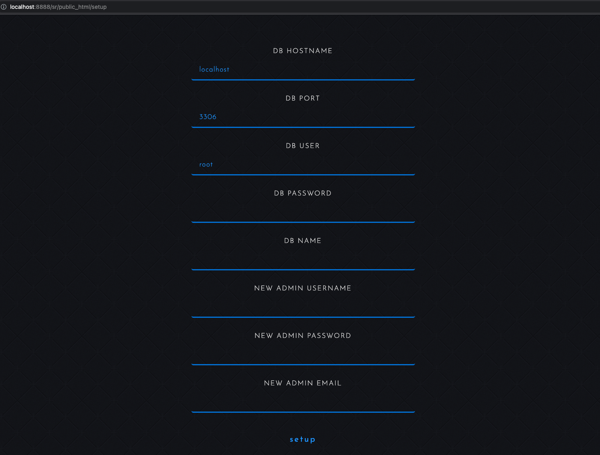

<a id="secret-republic---browser-based-php-hacker-themed-rpg---alpha-v4"></a>
# Secret Republic - Browser Based PHP Hacker Themed RPG - Alpha V4


[](https://github.com/nenuadrian/hacker-rpg-php-browser-based-game/actions/workflows/php.yml)
[](https://github.com/nenuadrian/hacker-rpg-php-browser-based-game/actions/workflows/docs-pages.yml)


## Table of Contents

- [Secret Republic - Browser Based PHP Hacker Themed RPG - Alpha V4](#secret-republic---browser-based-php-hacker-themed-rpg---alpha-v4)
  - [Table of Contents](#table-of-contents)
  - [Read about the journey](#read-about-the-journey)
  - [Overview](#overview)
  - [Main Features](#main-features)
  - [Simple Setup](#simple-setup)
  - [Cron jobs](#cron-jobs)
  - [Linting](#linting)
  - [Documentation](#documentation)
  - [Mobile app](#mobile-app)
  - [Screenshots](#screenshots)
    - [Skills](#skills)
    - [Knowledge base](#knowledge-base)
    - [Missions (there are email, database and file based servers which can be used to design different puzzles)](#missions-there-are-email-database-and-file-based-servers-which-can-be-used-to-design-different-puzzles)
    - [Simple rankings](#simple-rankings)
    - [Mission designer](#mission-designer)
    - [Rewards](#rewards)
    - [Edit account](#edit-account)
  - [Tests](#tests)
  - [Travelling through time - V1](#travelling-through-time---v1)
  - [License](#license)
  - [Secret Republic V3 (OLDER W/ MORE FEATURES)](#secret-republic-v3-older-w-more-features)

## Read about the journey

[Read article on Medium](https://adriannenu.medium.com/secret-republic-update-hacker-themed-browser-based-php-game-855299b4cdea)

## Overview

Audio trailer on Youtube: https://www.youtube.com/watch?v=6thfiGb-b7c

A lot of work has gone into this, but it not a fully documented project.

It's been through years of development with this being its 3rd itteration.

The project is not under active development with milestones in-place.

It is built upon the https://fuelphp.com MVC framework.

## Main Features

1. Audio AI (woman, same as trailer) voice speaks when interacting with the game

2. Futuristic minimalistic Bootstrap-based UI, mobile ready, made to feel like an app

3. Point and click based missions with servers of multiple types (file servers, email and database)

4. In-game Mission designer with BBCode like syntax features

5. Upgradable knowledge & skills

6. Rewards system


## Simple Setup

You need a webserver (e.g. MAMP/WAMP/XAMPP) able to run PHP (tested with 7.3) and a MySQL database (LAMP stack).

1. Install `composer` (the PHP dependency management system - `brew install composer` for MacOS) and run `composer install`

2. You will need to create an empty Database in MySQL - its name is not relevant, but you will need it in the next step. For MAMP, you would go to `http://localhost:8888/phpMyAdmin5`

3. Visit `http://localhost/public_html` - this may be different if you are using another port or directory structure, e.g. `http://localhost:8888/sr/public_html` and follow the setup process





## Cron jobs

You may want to setup cron tasks to run the following pages once in a while

your-url/cron/rankings

your-url/cron/emails

e.g.

*/2 * * * * wget -O - http://localhost/cron/emails >/dev/null 2>&1

https://en.wikipedia.org/wiki/Cron

## Linting

Checking PHP syntax
```
./fuel/vendor/bin/phplint ./ --exclude=vendor
```

## Documentation

This repository includes MkDocs Material documentation with:

1. The root `README.md` rendered as the docs home page.
2. Auto-generated code-reference pages for all `fuel/app/**/*.php` files.

Build it locally:

```
python3 -m venv .venv
source .venv/bin/activate
pip install -r requirements-docs.txt
mkdocs serve
```

Create a static site:

```
mkdocs build
```

Deploy to GitHub Pages:

1. The workflow at `.github/workflows/docs-pages.yml` runs on pushes to `master` (and manual dispatch).
2. In GitHub repository settings, set **Pages** source to **GitHub Actions**.

## Mobile app

One approach is to use these repositories: 
 * iOS: https://github.com/nenuadrian/iOS-website-elegant-rendering-swift-app
 * Android: https://github.com/nenuadrian/android-website-elegant-rendering

## Screenshots


### Skills


### Knowledge base


### Missions (there are email, database and file based servers which can be used to design different puzzles)


### Simple rankings


### Mission designer


### Rewards


### Edit account


## Tests

```
./fuel/vendor/phpunit/phpunit/phpunit tests
```

<a id="travelling-through-time---v1"></a>
## Travelling through time - V1


## License

<a rel="license" href="http://creativecommons.org/licenses/by/4.0/"></a>

Please link and contribute back to this repository if using the code or assets :)


## Secret Republic V3 (OLDER W/ MORE FEATURES)

V3 is much older, less organized and not respecting of any patterns what-so-ever in code, mostly based on a framework written from scratch.

Find version 3 here: https://github.com/nenuadrian/Secret-Republic-Hacking-Browser-Game-V3
